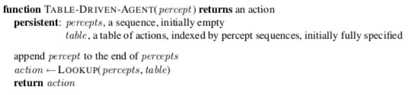

# Chapter 2: AGENTS

    def. Agent
    f:   Percepts[] => action

An agent receives as input a **percept sequence** (what sensors detected before + new detecion) and uses it to choose the **next action**. Action can change the environment around the agent.

The agent should choose the actions that maximize a performance measure (eg. `how many rooms it has cleaned` - `electricity spent`) (this measure should be objective).

For each possible percept sequence (aka. for each _state_), a rational agent should select an action that is expected to maximize its performance measure, given the evidence provided by the percept sequence and whatever built-in knowledge the agent has.

## Problems Classification

Environment

- Fully observable: all relevant information about the state are known
- Partially observable: noisy/unknown information
- unobservable: every information about the state is unknown (no sensors)

Agent

- Multi-agent: agent's action depends on other agents' actions (competitive or cooperative)
- Single-agent

Actions

- Stochastic: the pair (actual state + action) can result in more than one possibility. (see target + shoot => {hit:0.7, noHit:0.3})
- Deterministic: no randomness (multi-agent case: chess is deterministic even if the other agent is unpredictable)

Task 1

- Episodic: actions are independent (eg. rock paper scissors)
- Sequential: current decision can affect future decision (eg. chess)

Task 2

- Dynamic: environment can change while agent is deciding
- Static

Agent’s State of Knowledge

- Known: outcomes of actions are known
- Unknown: the agent must explore the environment to learn action's outcomes

## Agent Types

**Simple-reflex Agents**
Totally observable environment, knows rules that tell it what action to take, given a state.

**Model-based Agents**
Maintain percept history and decide with rules.

**Goal-based Agents**
Maintain percept history but use a heuristic to choose the fastest action to reach the goal.

**Utility-based Agents**
Maintain percept history but use a heuristic to maximize the utility of the action (not only reach the goal, but reach it in the best way).

**Learning Agents**
Take actions, critic the obtained results, update itself.

## State Types

**Atomic**
States are the nodes of a graph, edges are the actions. a Node do not have a particular content.

**Fractored**
A state contains attributes with values

**Structured**
A state contains a Graph (whose nodes can contain attributes)
