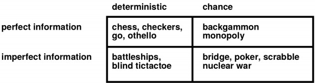

# Chapter 5: Games

The solution isn't a path, but is a strategy (: S -> A): specify moves for every possible opponent reply.

---

**MinMax Game**
basic game: in a tree eah leaf contains a score and the starting point is set on the root node.
Two players alternate choosing which branch should be taken (which child node).
Player 1 wants to arrive on a leaf with the greatest score possible, while player 2 wants to arrive on a leaf with the lowest score possible.
You are player 1 and you are at the root node, which branch will you choose now?

    prunedMinMax():
        // return the best score for player 1
        maxSearch(node, -inf, +inf)

    maxSearch(node, a, b):
        if (leaf(node)): return node.score

        // iterate through children to find the biggest
        biggest = -inf
        for c in children(node):
            v = minSearch(c, a, b)
            biggest = max(biggest, max)

            // b is the lowest value found by the MIN parent before
            // so, if the MAX find something bigger than b, the MIN would never choose this branch...
            // so, i don't need to analyze it anymore
            if biggest >= b : return biggest

            // update my 'best option untill now'
            a = max(a,biggest)
        return biggest

    minSearch(node, a, b):
        if (leaf(node)): return node.score

        smallest = +inf
        for c in children(node):
            smallest = min(smalest, maxSearch(c, a, b))

            if smallest <= a: return smallest
            b = min(b, smallest)
        return smallest

if full computation is too expensive, after a certaind depth, use a heuristic to predict the score.
In stochastics games the heuristic functions in much more important than the depth reached.
