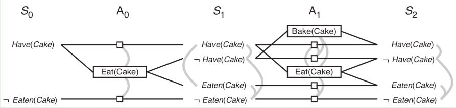

# Chapter 10: Planning

        Problem := (Initial State, Actions, States, Goal)
        Solution := list of actions needed to achieve the goal from the initial state

        State: conjunction of ground/functionless formulas
        Action := (name, Precondition, Effect)

        Precondition (needed to take that actions) is a conjunctions of literals

        Effect (action's consequences) = (ADD, DEL)  where ADD and DEL are conjunctions of literals

        result(state, action) = (state - action.DEL + action.ADD)

eg. action fly from Rome to Milan --> remove "me in Rome" and add "me in Milan" to the old state.

### Finding a valid plan

- **Forward**: BFS requires too much memory, so DFS with heuristics.

- **Backward**: from goal state undo actions. Pos(g') = (Pos(g) \ Add(a)) ∪ Pos(Precond(a)). Neg(g') = (Neg(g) \ Del(a)) ∪ Neg(Precond(a))

Heuristics for Forward search:

- ignore preconditions (relaxing the problem)
- remove literals of preconditions/actions that aren't in the goal
- ignore delete-list
- "state abstraction" (ignore less useful fluents)
- planning graphs

### Planning Graphs

directed graph with levels: S0, A0, S1, A1, S2, A2...

        S0: ground fluents in the initial state
        A0: actions applicable to S0

        Si: effects of all the actions at level Ai-1

mutex are in light gray and represent incompatibility.
white squares represent the action "do nothing"

actions have a mutex between them if:

- effect of one negates the effect of the other
- one delete a precondition of the other
- mutually exclusive preconditions

literals have mutex if there is no way to achieve them both

The graph is polinomial in the size of the problem. the Algorithm converges because Si increases monotonically but the number of literals is finite.

**heuristics**

- Max-level heuristic: the maximum level cost of the sub-goals
- Level-sum heuristic: the sum of the level costs of the goals (can be inadmissible, but can work well)
- Set-level heuristic: the level at which all goal literals appear together, without pairwise mutexes

**GraphLaplacian**

        1. build a level
        2. if (goal litarals without mutex):
                return rebuild_solution()
           elif (built_level.S == prev_level.S):
                return failure
        3. goTo 1.

### Planning as SAT & FOL

**SAT**

1. from fluents to PL propositions
   <At(P1, SFO), 3> ⇒ At_P1_SFO_3
   <Fly(P1, SFO, JFK), 3> ⇒ Fly_P1_SFO_JFK_3

2. States as conjunction of literals
   Init: At_P1_SFO_0 ∧ At_P2_JFK_0
   Goal: At_P1_JFK_3 ∧ At_P2_SFO_3

3. encode actions
   Action_i → (Precond_i ∧ Effects_i+1)

4. encode no-ops
   F_i+1 ↔ ∨_k [ActionCausingF] ∨( F_i ∧ ∧_j [¬ActionCausingNotFi] )

5. Mutex constraints: ¬Action1_i ∨ ¬Action2_i

that pass the translated problem to a SAT solver

**FOL**: not so convinient.
