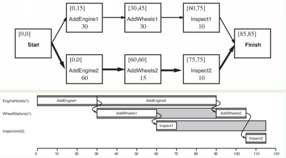

# Planning Applications

We add RESOURCES to the problem of planning (consume, use)

##### Scheduling without considering RESOURCES

    1. dependencies_graph = solve_planning_problem()
    2. ES[initial state] = 0
    3. for state in order_topological(plan):
           ES[state] = max( [ES[prev]+duration(prev)   for prev in actions_before(state)] )
    4. LS[goal state] = ES[goal state]
    5. for state in order_topological(plan, reverse=True):
           LS[state] = max( [LS[succ]-duration(succ)   for succ in actions_after(state)] )

Example of a scheduling

##### Hierarchical Planning

add refinements?? more ways to do a subplan?
